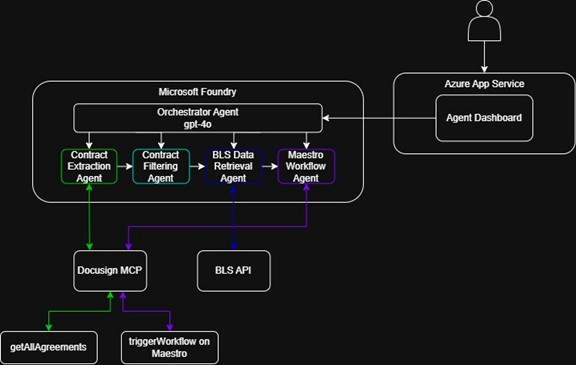

# Price Adjustment Agent

An intelligent multi-agent system that automates contract price adjustments using AI orchestration, Docusign MCP integration, and real-time inflation data from the Bureau of Labor Statistics.

## 🎯 Overview

The Price Adjustment Agent automatically:
- **Identifies** contracts expiring within 30 days via Docusign MCP server
- **Calculates** inflation-based price adjustments using real-time CPI data
- **Triggers** Docusign Maestro workflows for document generation
- **Tracks** all activities in a comprehensive SQLite database
- **Visualizes** progress through a real-time web dashboard

## ✨ Key Features

### 🎨 Real-time Web Dashboard
- **Live Workflow Pipeline**: Visual 4-step progress tracking
- **One-Click Triggers**: Start workflows instantly with user ID
- **Real-time Updates**: WebSocket-powered live status updates
- **Smart Status Display**: Differentiates between processed, skipped, and failed items
- **Toast Notifications**: Instant feedback on all actions
- **Responsive Design**: Works on desktop and mobile

### 🔗 Streamlit MCP Explorer
- **Direct MCP Tool Access**: Browse and call all Docusign MCP tools interactively
- **Agreement Management**: View agreements, envelopes, templates
- **Maestro Workflows**: Trigger and monitor workflows
- **Account Info**: View account details, users, branding, billing

### 🤖 AI-Powered Orchestration
- **Master Orchestrator**: GPT-4o coordinates the entire workflow via Microsoft Foundry
- **Docusign Navigator**: Finds and filters expiring agreements via MCP
- **BLS Agent**: Fetches CPI data and calculates adjustments
- **Maestro Agent**: Triggers Docusign workflows for amendments via MCP

## 🏗️ Architecture




## 🛠️ Tech Stack

- **Backend**: Flask (Python 3.8+) with Flask-SocketIO for real-time updates
- **AI**: Microsoft Foundry with GPT-4o
- **Docusign Integration**: MCP server via OAuth + JSON-RPC 2.0
- **Database**: SQLite with singleton pattern
- **APIs**: Docusign MCP, BLS.gov, Docusign Maestro
- **Frontend**: HTML/CSS/JavaScript with WebSocket support, Streamlit explorer
- **Deployment**: Azure App Service with Gunicorn + Eventlet

## 📦 Installation

### Prerequisites

- Python 3.8 or higher
- Microsoft Foundry project (required for AI orchestration)
- Docusign Developer Account with MCP access
- BLS API Key (optional — works without, limited to 25 requests/day)

## 🎨 Using the Dashboard

### Main Interface

1. **Workflow Pipeline** — Visual 4-step process:
   - Step 1: Contract Extraction (Docusign Navigator)
   - Step 2: Contract Filtering (Identifies unprocessed agreements)
   - Step 3: Price Calculation (BLS Agent with CPI data)
   - Step 4: Amendment & Workflow (Maestro Agent)

2. **Start Workflow Panel**:
   - Enter User ID (e.g., "ashutosh" or any identifier)
   - Click "Start Manual Workflow"
   - Watch real-time progress via WebSocket

3. **Status Summary**:
   - Current workflow status
   - Contracts found and processed
   - Total adjustment amounts

### Workflow States

- **✅ Green**: Step completed successfully
- **🟡 Orange**: Step currently processing
- **🔘 Gray**: Step skipped (no action needed)
- **❌ Red**: Step failed

## 🔄 Workflow Process

1. **Discovery**: Finds agreements expiring in next 30 days via Docusign MCP `getAllAgreements`
2. **Filtering**: Identifies which agreements haven't been processed yet
3. **Calculation**: Fetches CPI data from BLS.gov and calculates inflation-based adjustments
4. **Execution**: Triggers Docusign Maestro workflows via MCP `triggerWorkflow`

## ☁️ Azure Deployment

The app deploys to Azure App Service. Configuration is in `.azure/config`:

- **App name**: `docusign-price-adjustment`
- **Resource group**: `rg-price-adjustment`
- **Region**: Sweden Central
- **SKU**: F1 (Free tier)

### Startup

Azure uses `startup.sh` which runs:
```bash
gunicorn --worker-class eventlet -w 1 \
  --bind=0.0.0.0:${PORT:-8000} \
  --timeout 600 \
  app:app
```

Set your environment variables in Azure App Service > Configuration > Application Settings.
`WEBSITE_HOSTNAME` is set automatically by Azure and used to build the OAuth callback URL.

## 🔍 Troubleshooting

### Common Issues

1. **"No agreements found"**: Normal if no contracts expire in next 30 days
2. **"All already processed"**: System correctly skips processed agreements
3. **Connection issues**: Check `MICROSOFT_FOUNDRY_ENDPOINT` is set and Azure identity is configured
4. **Docusign errors**: Visit `/docusign/oauth/start` to re-authenticate
5. **Token expired**: The MCP client auto-refreshes tokens; if it fails, re-authenticate via OAuth


